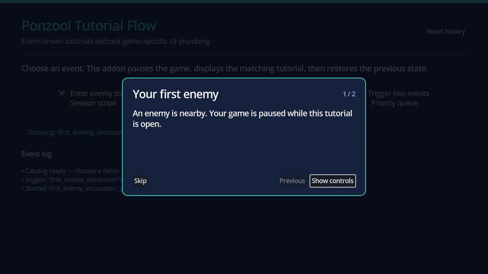

# Ponzool Tutorial Flow

Event-driven popup tutorials for Godot. Your game decides **when** guidance should appear; Ponzool handles pages, pause restoration, priority queueing, and display history.

> Development preview: verified with Godot 4.7 stable on Windows 64-bit using the Compatibility renderer. Other Godot versions, platforms, and renderers remain unvalidated. Public distribution is blocked until an approved license replaces `LICENSE-REQUIRED.txt`.



## What you can build

- Pause the game the first time a player meets an enemy, then restore the previous pause state.
- Show a multi-page explanation after an item pickup.
- Queue simultaneous tutorial events without overlapping popups.
- Display a tutorial every time, once per session, or once per installation.
- Export and import global tutorial history through your own save system.

Ponzool does not detect enemies, items, inventory, or player actions. Your game keeps those systems and triggers the matching tutorial ID:

```gdscript
TutorialFlow.trigger("first_enemy_encounter")
```

This repository contains the Free popup edition only. Guided Tutorial Pro is a separate product and is not included.

## Try the inspectable demo

1. Open this repository with Godot 4.7.
2. Press **F6** with `demo/main.tscn` open, or press **F5**.
3. Choose **Enter enemy zone**, **Pick up item**, or **Trigger two events**.
4. Use **Reset history** to repeat once-only tutorials.

The saved scene and Resources show the nodes, Catalog, pages, and signal integration without hiding the setup in generated content.

## Install in another project

1. Copy `addons/ponzool_tutorial_flow/` into the same path in your project.
2. Enable **Ponzool Tutorial Flow** under **Project > Project Settings > Plugins**. The plugin registers the `TutorialFlow` Autoload.
3. Create `PonzoolTutorialPage` and `PonzoolTutorial` Resources, then add them to a `PonzoolTutorialCatalog`.
4. Register the Catalog during startup:

```gdscript
@export var tutorial_catalog: PonzoolTutorialCatalog

func _ready() -> void:
	var errors := TutorialFlow.set_catalog(tutorial_catalog)
	if not errors.is_empty():
		push_error("Tutorial catalog is invalid: %s" % errors)
```

5. Call `TutorialFlow.trigger(id)` from your existing gameplay events.

See the [API reference](docs/api.md) and the Resources in [`demo/tutorials/`](demo/tutorials/).

## Included

- Godot EditorPlugin and Autoload runtime under `addons/ponzool_tutorial_flow/`
- Resource-based pages, tutorials, and Catalog
- Multiple text pages and optional `Texture2D` images
- Stable priority queue with duplicate suppression
- Always, session, and persistent global display scopes
- Versioned state export/import for integration with existing save slots
- Catalog validation, lifecycle signals, and history reset APIs
- Built-in popup with keyboard focus, Escape close, and custom `Theme` support
- Inspectable demo Resources and automated tests

## Boundaries

- No enemy, item, inventory, dialogue, quest, or save-slot system is included.
- Spotlight targeting, world markers, input blocking, action completion, and branching are not included.
- The built-in popup supports a custom Godot `Theme`; complete popup-scene replacement is not supported in this preview.
- If another system changes `SceneTree.paused` while Ponzool owns the pause, Ponzool restores the state captured when the tutorial sequence began.

## Verification

```powershell
$godot = (Get-Command Godot_v4.7-stable_win64_console.exe).Source
& $godot --headless --editor --path . --quit
& $godot --headless --path . --script tests/test_tutorial_flow.gd
& $godot --headless --path . -- --auto-demo
```

Expected markers are `TESTS PASSED` and `DEMO PASSED`.

## AI-assisted content

GDScript, documentation, and demo copy were created with AI assistance and reviewed through local diff inspection, Godot import, automated tests, and direct demo inspection. Store images are captures of the included demo; no AI-generated graphics or audio are included.

## License status

No distribution license has been selected. Do not publish or redistribute this preview until `LICENSE-REQUIRED.txt` is replaced by an approved `LICENSE` or `LICENSE.md` and the addon's copy matches it.
